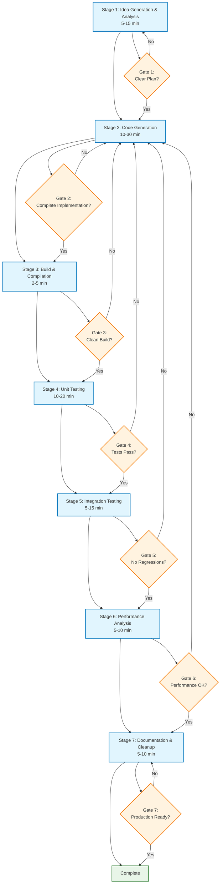

# LLM-Assisted Development Execution Cycle

This document defines the execution cycle for exploring ideas, generating code, testing, and verifying implementations using LLM assistance.

## Overview

The development cycle is designed to maximize the effectiveness of human-LLM collaboration by establishing clear stages, feedback loops, and validation checkpoints.

## Core Execution Cycle

## Core Execution Cycle

### Stage 1: Idea Generation & Analysis
**Duration:** 5-15 minutes
**Tools:** LLM conversation, existing codebase analysis

**Activities:**
1. **Problem Definition**
   - Clearly articulate the feature/improvement/bug fix
   - Identify affected components and modules
   - Estimate complexity and scope

2. **Codebase Analysis**
   - Review existing similar implementations
   - Identify integration points and dependencies
   - Analyze current architecture patterns

3. **Approach Planning**
   - Generate multiple implementation approaches
   - Evaluate trade-offs (performance, maintainability, complexity)
   - Select preferred approach with rationale

**Output:** Implementation plan with clear objectives and approach

### Stage 2: Code Generation
**Duration:** 10-30 minutes
**Tools:** LLM assistance, templates, existing patterns

**Activities:**
1. **Template Selection**
   - Choose appropriate code patterns from project
   - Identify reusable components or interfaces
   - Apply project-specific conventions

2. **Implementation Generation**
   - Generate core implementation following established patterns
   - Create necessary headers and interfaces
   - Include error handling and edge cases

3. **Integration Planning**
   - Plan how new code integrates with existing systems
   - Identify required changes to existing files
   - Plan testing strategy

**Output:** Complete implementation ready for testing

### Stage 3: Build & Compilation
**Duration:** 2-5 minutes
**Tools:** CMake, compiler toolchain

**Activities:**
1. **Build System Updates**
   - Update CMakeLists.txt if needed
   - Add new source files to build
   - Configure dependencies

2. **Compilation Verification**
   - Clean build from scratch
   - Verify all targets compile successfully
   - Check for warnings and address them

3. **Static Analysis**
   - Run clang-tidy checks
   - Verify code formatting
   - Check for potential issues

**Output:** Successfully compiled code with clean static analysis

### Stage 4: Unit Testing
**Duration:** 10-20 minutes
**Tools:** Test framework, custom test utilities

**Activities:**
1. **Test Design**
   - Create comprehensive unit tests for new functionality
   - Test edge cases and error conditions
   - Verify integration with existing components

2. **Test Implementation**
   - Write parseable test outputs (JSON/XML)
   - Include performance benchmarks where relevant
   - Add memory usage verification

3. **Test Execution**
   - Run all tests in isolation
   - Verify test coverage meets standards
   - Document any test failures or limitations

**Output:** Comprehensive test suite with passing results

### Stage 5: Integration Testing
**Duration:** 5-15 minutes
**Tools:** Full application build, runtime testing

**Activities:**
1. **Runtime Verification**
   - Test new functionality in complete application
   - Verify performance characteristics
   - Check for memory leaks or resource issues

2. **Regression Testing**
   - Ensure existing functionality remains intact
   - Run automated benchmark suite
   - Verify no performance regressions

3. **User Experience Testing**
   - Test from user perspective
   - Verify intuitive behavior
   - Check for unexpected interactions

**Output:** Verified working implementation in full context

### Stage 6: Performance Analysis
**Duration:** 5-10 minutes
**Tools:** Profiling tools, benchmarks

**Activities:**
1. **Performance Measurement**
   - Run performance benchmarks
   - Compare against baseline metrics
   - Identify any performance bottlenecks

2. **Memory Analysis**
   - Check memory usage patterns
   - Verify no memory leaks
   - Analyze allocation patterns

3. **Optimization Opportunities**
   - Identify potential optimizations
   - Document performance characteristics
   - Plan future improvements if needed

**Output:** Performance analysis report with recommendations

### Stage 7: Documentation & Cleanup
**Duration:** 5-10 minutes
**Tools:** Documentation system, code review

**Activities:**
1. **Code Documentation**
   - Add/update function documentation
   - Document any new patterns or approaches
   - Update CLAUDE.md if needed

2. **Code Review**
   - Self-review for code quality
   - Check adherence to project conventions
   - Verify error handling is appropriate

3. **Cleanup**
   - Remove debugging code
   - Clean up commented code
   - Verify formatting consistency

**Output:** Production-ready code with documentation

## Quality Gates

Each stage has specific quality gates that must be met before proceeding:

1. **Stage 1 Gate:** Clear, actionable plan with defined success criteria
2. **Stage 2 Gate:** Complete implementation following project patterns
3. **Stage 3 Gate:** Clean compilation with no warnings
4. **Stage 4 Gate:** All tests passing with adequate coverage
5. **Stage 5 Gate:** No regressions in existing functionality
6. **Stage 6 Gate:** Performance meets or exceeds requirements
7. **Stage 7 Gate:** Code ready for production deployment

## Feedback Loops

### Immediate Feedback (Within Stage)
- Compilation errors → Code generation refinement
- Test failures → Implementation fixes
- Performance issues → Code optimization

### Cross-Stage Feedback
- Stage 5 issues → Return to Stage 2 for redesign
- Stage 6 problems → Return to Stage 2 for optimization
- Stage 4 failures → Return to Stage 2 for bug fixes

### Long-term Feedback
- Pattern effectiveness → Update templates and guidelines
- Common failure modes → Improve quality gates
- Performance trends → Adjust benchmarks and standards

## Metrics and Monitoring

### Cycle Time Metrics
- Time per stage
- Total cycle time
- Rework frequency
- Success rate per stage

### Quality Metrics
- Test coverage percentage
- Bug discovery rate
- Performance regression frequency
- Code review feedback volume

### Learning Metrics
- Pattern reuse effectiveness
- LLM suggestion accuracy
- Human-LLM collaboration efficiency
- Knowledge transfer effectiveness

## Continuous Improvement

The cycle itself should be continuously refined based on:
- Metrics analysis
- Developer feedback
- LLM capability evolution
- Project complexity changes

Regular reviews (weekly/monthly) should evaluate:
- Cycle effectiveness
- Bottleneck identification
- Tool improvements needed
- Process refinements

## Future Enhancements

### Planned Improvements
1. **Automated Stage Transitions:** Reduce manual overhead
2. **Enhanced Metrics Collection:** More detailed performance data
3. **Intelligent Failure Recovery:** Better handling of quality gate failures
4. **Learning from History:** Use past cycles to improve future predictions
5. **Multi-LLM Collaboration:** Specialized LLMs for different stages